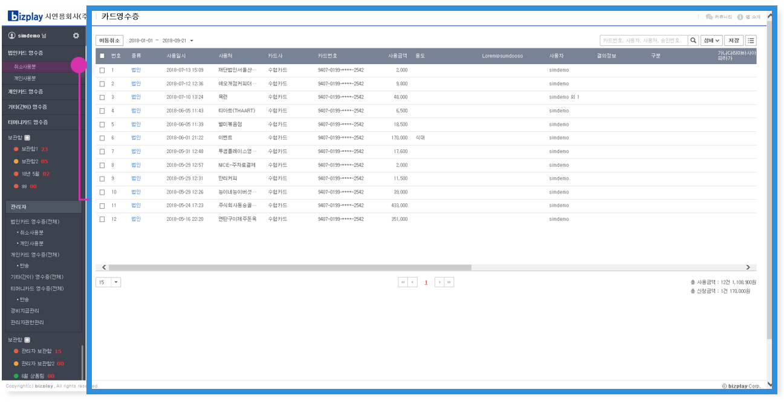
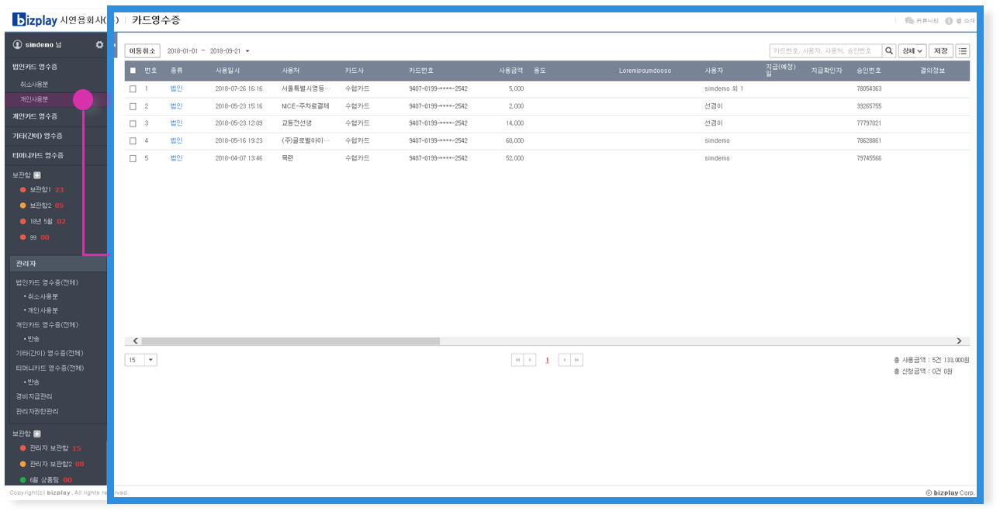
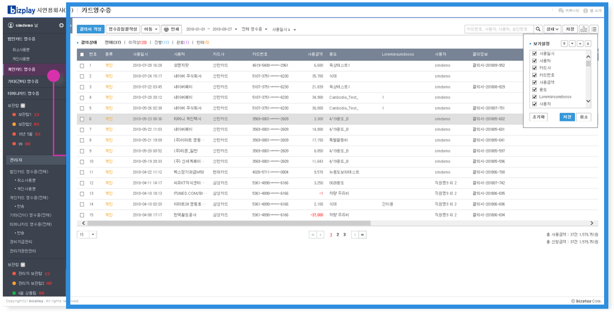
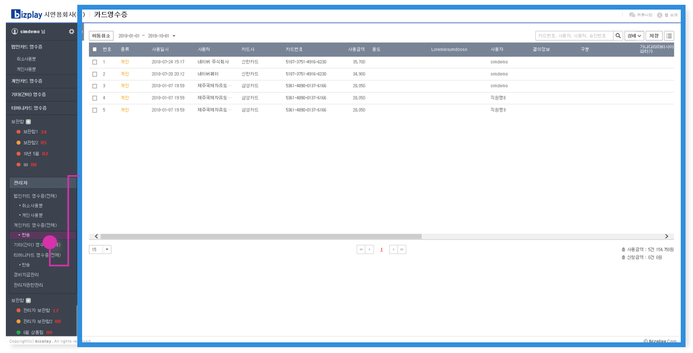
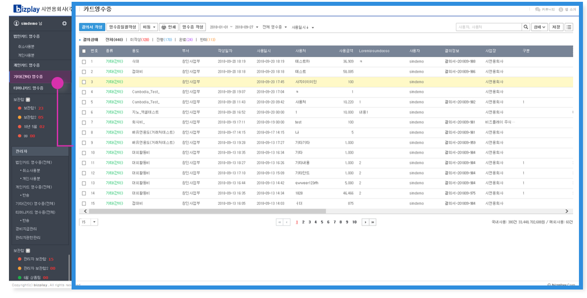
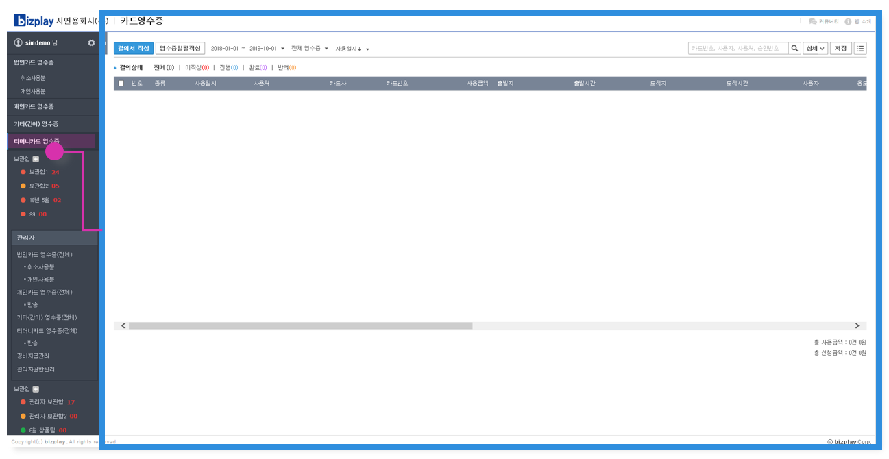
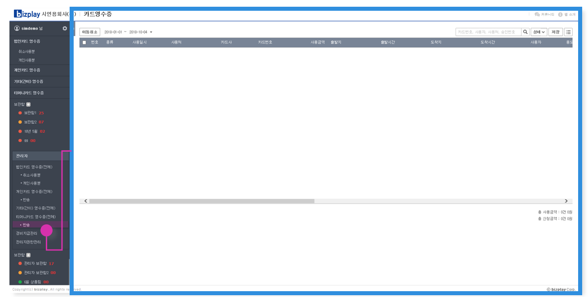
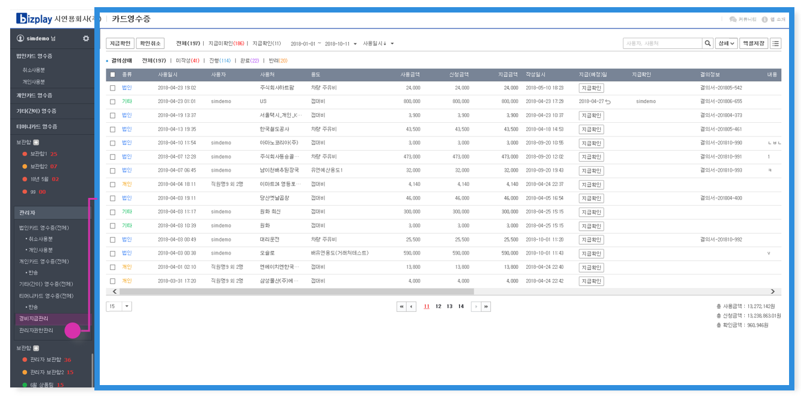

# 카드영수증

## 온라인 카드영수증 APP

1. 메뉴 소개




* **취소 사용분**

    **※ 기능 소개**

\*\*\*\*

1. 법인카드 영수증 취소사용분 메인화면

2. 이동취소 팝업

3. 달력박스

4. 영수증 검색

5. 영수증 상세 검색

6. 인쇄

7. 달력

8. 영수증 종류

9. 영수증 정렬

10. 영수증 검색

11. 영수증 상세검색

12. 영수증 저장\(EXCEL저장\)

13. 영수증 리스트 테이블

* **개인 사용분**

     **※ 기능 소개**

~~_**187p**_~~

1. 법인카드 영수증 개인사용분 메인화면

2. 이동취소 팝업

3. 달력박스

4. 영수증 검색

5. 영수증 상세 검색

6. 인쇄

7. 달력

8. 영수증 종류

9. 영수증 정렬

10. 영수증 검색

11. 영수증 상세검색

12. 영수증 저장\(EXCEL저장\)

13. 영수증 리스트 테이블




* **개인카드 영수증 \(전체\)**

**※ 기능 소개**

~~_210p_~~

2. 지출결의서 결의서 작성

3. 출장명세서 작성

4. 영수증 일괄작성

5. 이동

6. 인쇄

7. 달력

8. 영수증 종류

9. 영수증 정렬

10. 영수증 검색

11. 영수증 상세검색

12. PDF/EXCEL 저장

13. 개인 요약 보고서

14. 보기설정 리스트

15. 영수증 리스트 테이블

 

* **반송 개인카드 영수증 \(관리자\)**

**※ 기능 소개**

~~_**913p**_~~

1. 법인카드 영수증 취소사용분 메인화면

2. 이동취소

3. 달력박스

4. 영수증 검색

5. 영수증 상세 검색

6. 영수증 저장\(EXCEL 저장\)

7. 보기설정 리스트

8. 영수증 리스트 테이블




**※ 기능 소개** 

~~_342p_~~

  
1. 기타\(간이\) 영수증 메인화면

2. 결의서 작성

3. 영수증 일괄작성

4. 이동

5. 인쇄

6. 영수증 작성

7. 달력

8. 영수증 종류

9. 영수증 정렬

10. 영수증 검색

11. 영수증 상세검색

12. PDF/EXCEL 저장

14. 보기설정 리스트

15. 영수증 리스트 테이블




* **티머니카드 영수증 \(전체\)**

**※ 기능 소개** 

~~_**1003p**_~~

1. 티머니카드 영수증 메인화면

2. 결의서 작성

3. 영수증일괄작성

4. 달력\(날짜 설정\)

5. 영수증 종류

6. 영수증 정렬

7. 영수증 검색

8. 영수증 상세검색

9. PDF/EXCEL 저장

10. 보기설정 리스트

11. 영수증 리스트 테이블

* **반송 티머니카드 영수증 \(관리자\)**

~~_**1056p**_~~

**※ 기능 소개** 

1. 반송 티머니카드 영수증 메인화면

2. 이동취소

3. 달력박스

4. 영수증 검색

5. 영수증 상세 검색

6. 영수증 저장\(EXCEL 저장\)

7. 보기설정 리스트

8. 영수증 리스트 테이블







아래의 항목들은 관리자에게만 주어지는 메뉴입니다.

**▶반송 개인카드 영수증 : 두번째 탭에서 설명**

**▶반송 티머니카드 영수증**

**▶경비지급관리**

**▶관리자권한관리**

* **경비지급관리**

**※ 기능 소개**

~~_**1077p**_~~

1. 경비지급관리 메인화면

2. 지급확인

3. 확인취소

4. 달력\(날짜설정\)

5. 영수증 정렬

6. 영수증 검색\(사용자, 사용처\)

7. 영수증 상세검색

8. 엑셀저장

9. 보기설정 리스트

10. 기안문서

11. 영수증 리스트 테이블

* **관리자권한관리**

\*\*\*\*

**※ 기능 소개**



