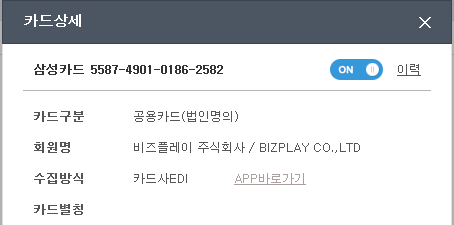

# 법인카드

## 법인카드 유형 별 표기 방식 

법인카드의 유형은 총 3가지로 나뉘어 있으며, 비즈플레이에서는 **구분**과 **회원명** 표기를 확인하여 구별 이 가능합니다.

| 유형 | 구분표기 | 회원명 | 상환의무 |
| :--- | :--- | :--- | :--- |
| 기업 법인카드\(공용\) | 사용자지정\(법명의\) | 회사명 | 기업 |
| 기업 법인카드\(기명식\) | 사용자지정\(개인명의\) | 임직원명 | 기업 |
| 개인형 법인카드 | 개인계좌지정 | 임직원명 | 개인1차, 기업2차 |


법인카드관리APP에서는 아래와 같이 보입니다.  



## 카드 사 별 한도 정보 제공 

| 구분 | 제공하는 카드사 |
| :--- | :--- |
| 카드 별 총 한도 | **삼성, 롯데, 농협, 전북, 시티, 신한, 우리, 하나, 현대, 기업, 국민** |
| 카드 별 잔여 한도 | **삼성, 농협, 전북, 시티, 신한, 우리, 현대, 기업, 국민** |

## BC카드 EDI추가 비용

일부 은행 BC카드의 경우, 고객 'EDI 신청' 시 BCAS 데이터 전송서비스 7,820원 \(VAT포함\)이 추가됩니다.

대상: 신한, 경남, 부산, 대구, 씨티, SC   
금액: 7,820원/月 \(VAT포함\)

## **법인체크카드를 이용중인데 모바일에서 이번 달 사용금액과 한도금액이 보이지 않습니다.** 

체크카드는 사용내역만 제공되고 한도와 이번 달 사용금액이 제공되지 않습니다.   
**사업자 체크 카드는 통장 잔액이 카드 한도**이기 때문에 보안 등급이 높아 별도로 제공하지 않고 모바일 앱에서도 한도 및 사용금액이 ‘0’으로 표기되고 있습니다.

