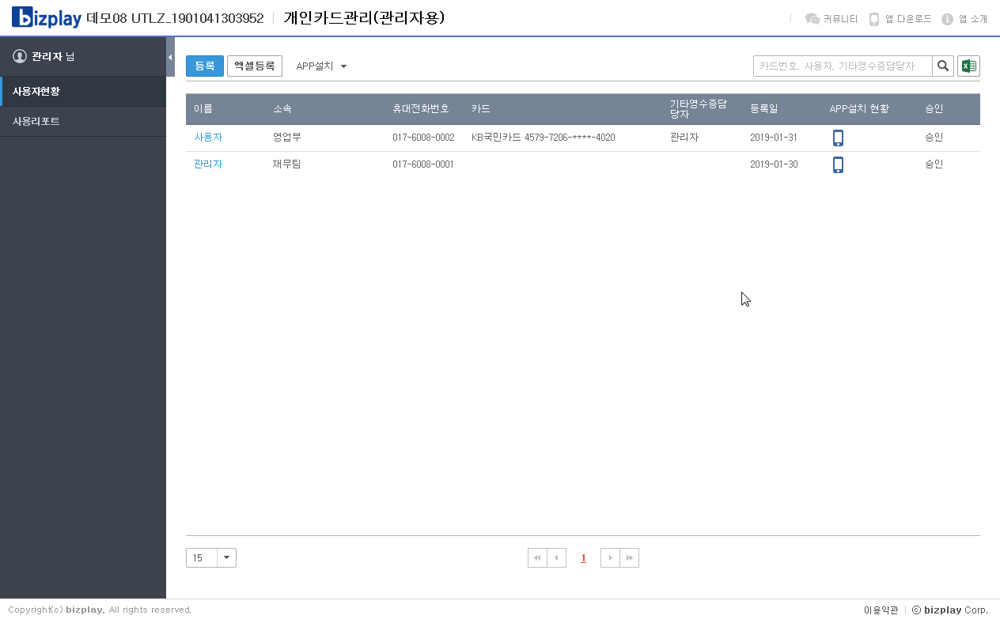

# 기타 영수증

## 기타영수증에 대한 영수증 담당자 지정은 어떻게 하나요? 

기타영수증에 대한 영수증 담당자는 개인카드관리APP에서 설정할 수 있습니다.

1. **개인카드관리\(관리자용\)APP** 을 실행합니다.
2. **사용자현황** 메뉴를 클릭합니다.
3. 영수증을 작성하는 직원의 이름을 선택합니다.
4. 해당 직원의 기타영수증의 경비처리를 대행하는 영수증 담당자를 지정합니다.


사용자 별로 기타영수증을 1회 작성한 이후에 영수증 담당자 지정이 가능합니다. \(개선예정\)  
영수증 담당자는 PC에서만 볼 수 있습니다.


