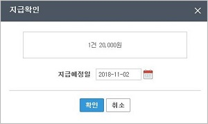

# 경비지급

## 지급요청, 예정, 완료의 프로세스

## 각 메뉴 별 설명

#### 지급요청내역

지급요청내역은 사용자가 경비처리 후 지급이 되어야 하는 건 들이 기본적으로 생성되며, **지급확인** 버튼을 클릭하여 **지급예정일**을 설정하고 **지급확인**을 할 수 있습니다.

#### 지급예정내역

지급예정내역은 지급요청내역에서 **지급확인**한 내역을 확인할 수 있으며, 지급을 위한 이체용 엑셀 파일을 생성할 수 있으며, 지급 후 **지급완료** 버튼을 클릭하여 지급된 날짜를 입력할 수 있습니다.

#### 지급완료내역

지급예정내역에서 지급완료를 실행한 내역이 최종적으로 보여지며 지급일 정보로 언제 지급되었는지 확인할 수 있습니다.

