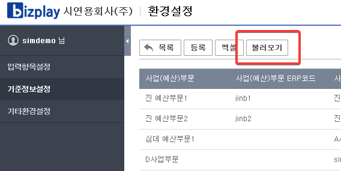
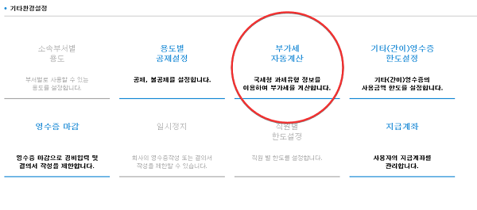

# 환경설정

## 소속부서와 사업\(예산\)부서를 동일하게 설정하기 위한 방법


1. 비즈플레이 **회사 &gt; 부서정보** 메뉴에 들어가서 현재 부서 설정이 다 되어 있는지 확인
2. **환경설정APP &gt; 입력항목설정 &gt; 직원/부서** 에서 **업데이트**를 실행
3. **환경설정APP &gt; 기준정보설정 &gt; 사업\(예산\)**부서 에서 **불러오기**를 실행

_1번과 2번의 동기화는 매일 24시에 자동으로 실행되며, 바로 업데이트가 필요할 경우에 클릭합니다._


## 소속된 부서로 사업\(예산\)부서가 기본 세팅이 되지 않을 때 확인사항


아래의 순서대로 불러오기를 합니다.

1. 비즈플레이 **회사 &gt; 직원관리** 메뉴에 해당 직원의 부서가 세팅되어 있는지 확인
2. **환경설정APP &gt; 입력항목설정 &gt; 직원/부서** 에서 **업데이트**를 실행
3. **환경설정APP &gt; 기준정보설정 &gt; 사업\(예산\)**부서 에서 **불러오기**를 실행



현재는 바닥화면의 '불러오기'를 해서 생성된 사업부서만 매칭키가 생성되어 소속부서와 연결이 됩니다. \(수정을 해서 가져오기를 하면 매칭되지 않습니다.\)



## 부가세 자동 계산 설정

카드사에서 제공하는 공급가액, 부가세액과는 별개로 사용처 사업자번호를 기준으로 국세청에 조회를 하여 부가세를 재 계산하는 기능입니다.


기본 설정은 OFF로 되어 있으며, 설정을 ON으로 변경 이후의 영수증 부터 자동계산합니다.


## 부가세 계산식

$$
부가세 = (총 승인(매입)금액 - 봉사료) / 11
$$


비즈플레이의 계산방식과 각 POS단말기의 계산방식은 원단위 절사에 따라서 차이가 발생할 수 있습니다. 이러한 원단위 절사 방식은 국세청에서도 허용하는 부분이며 특정 계산식이 잘못되었다고 보기는 어렵습니다.


## 부가세 계산 예외 처리

부가세 자동계산 기능을 사용하는 경우 과세유형에 따른 부가세를 계산하지만 아래의 경우에는 계산을 하지 않습니다.

> 가맹점명이 아래의 키워드인 경우  
> 철도, 항공, 버스, 목욕, 미용, 사우나, 이발, 매표소, 서적, 서점, 문고, 학교, 학원, 강습소, 고속도로카드, 통행료, 병원, 의원, 약국, 택시, 면세점, 상품권

> 가맹점사업자 번호가 아래의 번호인 경우  
> '1298200103','1298197052','2298137000','1028111670','2148662195','1108114794','1048117480','1218189086','4018132460','6168150527','1048183559'

