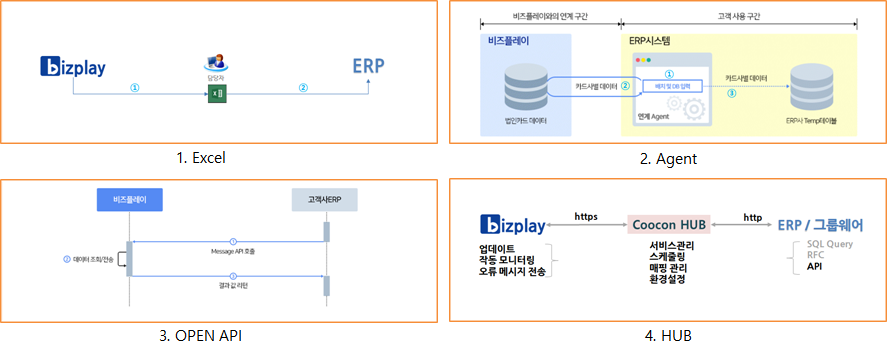

# ERP연계



\[개요\]  
- 고객사에서 원하는 ERP 문서 양식을  bizplay에서 EXCEL 문서로 저장하여 ERP시스템에 자료를   
 올리 수 있게 지원을 합니다.

                                                                      `{그림1} EXCLE 방식`  
       
     ① bizplay에서 엑셀 다운로드 양식을 설정 하고 조회된 자료를 EXCEL문서로 저장을 합니다.  
     ② 내 PC에 저장된 EXCEL 문서를 ERP에서 제공하는 기능을 이용하여 자료를 upload 합니다.  
  
      `※ ERP사에 UPLOAD 제공 여부를 확인하여 주세요.  
 ※ 표준 엑셀 다운로드 양식에 원하는 문서가 없으시면 요청하여 주세요.`  
  
\[ERP 연계\]  
 - 더존, 이카운트, SAP등 ERP사에서 제공하는 표준 기본 양식을 지원 합니다.  
  
  ▶ bizplay 엑셀 다운로드 양식 설정 방법입니다.

     ① "환경설정"앱을 클릭 합니다.

     ② "입력항목설정"을 클릭 합니다.  
     ③ "용도"를 클릭하여 설정 합니다.

    ④ "세부설정"을 클릭 합니다.  
    ⑤ "ERP 연계를 위한 정보를 설정합니다." 클릭 합니다.  
        - 용도ERP코드, 상대계정코, 계정과목 설정을 합니다.

   ⑥ "영수증"을 클릭 합니다.

  ⑦ 좌측 상단에 "설정"을 클릭 합니다.

   ⑧ ERP사에 맞추어  "엑셀 다운로드 양식 설정" 을 합니다.

   ⑨ " 관리자" 에서 원하는 메뉴를 클릭하여 사용내역을 조회 합니다.  
   ⑩ "저장" 버튼을 클릭 하여 ⑪" EXCEL저장" 버튼을 클릭하여 문서를 저장 합니다.

                                 `{그림} EXCEL 양식`

  ▶ 더존 Smart A 엑셀 올리기 사용법입니다.

  ① "매입매출전표입력" 탭으로 이동 합니다.  
  ② "기능모음\(f11\)" 클릭 합니다.  
  ③ 리스트 중에  "엑셀올리기" 클릭하여 자료를 업로드 합니다.`※ EXCEL양식에 "거래처명" 정보는 더존 Smart A에 등록된 내역만 정상적으로 업로드 됩니다.`

 - 더존 Smart A이외에 더존 iCUBE, iU ERP연계 표준양식을 지원 합니다.

 - FAQ  
  ① Smart A 엑셀 업로드 파일에 포함된 거래처\(가맹점\) 정보 문의 ?  
    답변 : Smart A에 등록된 거래처\(가맹점\)만 정상적으로 업로드 됩니다.  
  ② bizplay에서 다운로드 한 엑셀 파일 내용 중 기본계정이 공란인 경우 문의 ?  
    답변 : 입력항목설정에서 용도ERP코드를 입력해야 합니다.  
              bizplay 사용법 ③ ~ ⑤ 참조 하시면 됩니다.



\[개요\]  
 - ERP사에서 생성한 Temp 테이블에 bizplay에서 제공하는 경비관리 데이터를 저장합니다.

                                                                      `{그림1} 에이전트 방식`  
  
① ERP시스템에 설치한 연계 Agent데몬이 설정한 시간에 작업을 시작 합니다.  
② bizplay OPEN API 호출 하여 응답 받습니다.  
③ ERP사에서 생성한 Temp테이블에 데이터를 저장 합니다.  
  
 ~~`※ 고객사 DBMS는 Oracle, MS-Sql, DB2, 파일DB 등 가능 합니다.  
※ ③번 DB 저장 외 SAP RFC방식, FTP(파일전송) 등 가능 합니다.  
※ Temp Table에서 내부에 활용하는 업무는 고객 또는 ERP업체가 작업 해야 합니다.`~~  
  
\[방화벽 설정\]  
 - bizplay는 OPEN API 로 연결 되어 아래와 같은 Out-Bound 방화벽 설정이 필요 합니다.  
  \(In-bound 없음\)

                                  `{그림2] 방화벽 설정`  
  
① bizplay는 목동 KT IDC센터에 금융 클라우드 센터로 운영 합니다.  
② 도착지 호출은 URL 방식으로 내부 서버에서 DNS를 찾을 수 없으면 HOSTS파일에 등록해야   
    합니다.  
③ 개발 API 전문테스트는 개발 작업 시 에만 필요 합니다.  
④ 이미지 링크는 ERP나 GW에서 첨부 이미지 링크가 필요할 경우 사용 합니다.  
  
\[DB접속정보\]  
  - 생성된 DB Temp 테이블 접속 할 수 있는 계정과 암호를 제공하여 주어야 합니다.  
  
\[에이전트 설치 사양\]  
 - H/W, O/S 설치 사양 입니다.

                                `{그림3} H/W, O/S 사양`

~~`※ MS 서버만 설치 가능합니다.`~~`MS 서버만 설치 가능합니다.`  
~~`※ ORACLE, MSSQL DB만 접근 가능합니다.`~~  
  
\[파일첨부\]  
 - API 키 발급 신청서  
 - 쿠콘 상품 이용 신청서  
 - 에이전트\_연계방법 안내 설명서



\[개요\]  
- bizplay에서 제공하는 API를 통해 ERP사에서 개발을 진행 합니다.

                                                                              `{그림1} API방식`  
  
① Message API 호출을 bizplay로 전송 합니다.  
② 데이터 조회/전송을 수행 합니다.  
③ 요청된 결과 값을 다시 전송 합니다.  
~~`※ 고객을 식별할 수 있는 고유 키를 발급해 드립니다.`~~  
~~`※ 운영 환경은 Https 인증방식 암호화 합니다.`~~  
  
\[방화벽 설정\]  
 - bizplay는 OPEN API 로 연결 되어 아래와 같은 Out-Bound 방화벽 설정이 필요 합니다.  
  \(In-bound 없음\)

                                  `{그림2] 방화벽 설정`

① bizplay는 목동 KT IDC센터에 금융 클라우드 센터로 운영 합니다.  
② 도착지 호출은 URL 방식으로 내부 서버에서 DNS를 찾을 수 없으면 HOSTS파일에 등록해야   
    합니다.  
③ 개발 API 전문테스트는 개발 작업 시 에만 필요 합니다.  
④ 이미지 링크는 ERP나 GW에서 첨부 이미지 링크가 필요할 경우 사용 합니다.

\[API 실습\]  
 - GET방식으로 외부 사이트를 이용하여 실습을 합니다.

                                `{그림3} API URL`

▶ 개발 전문을 테스트 페이지에서 확인 합니다.  
     ①  [http://](http://webankdev.appplay.co.kr/api_test.jsp)[webankdev.appplay.co.kr/api\_test.jsp](http://webankdev.appplay.co.kr/api_test.jsp) 온라인에서 열고   
     ② 서비스 코드 목록을  ‘카드영수증 처리내역 조회\(0411\) 선택 쿼리전송 &gt; 팝업\(확인\)&gt; 잠시 대기   
         &gt; 결과 보임  
     ③ 결과 확인 [http://](http://jsonviewer.stack.hu/)[jsonviewer.stack.hu/](http://jsonviewer.stack.hu/) 에 접속  ②번 결과 전체 복사  
     ④ 결과 확인 페이지에  붙여넣기&gt; Format tab으로 이동   
  
{첨부파일}  
 - API 정의서  
 - API 연동방법 안내 설명서  
 - API 키 발급 신청서  



\[HUB 설치 사양\]  
 - H/W, O/S 설치 사양 입니다.




\[ERP연계 비교\]
























